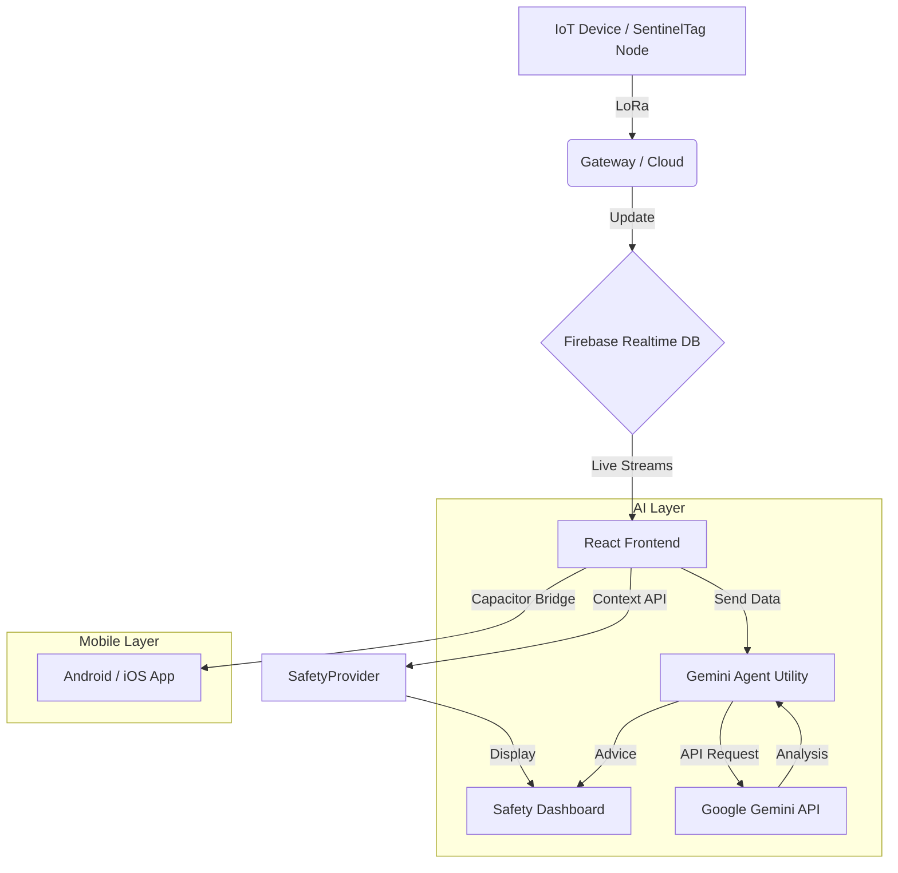

# SentinelTag — Gemini AI & Project Documentation

This document provides a high-level overview of the SentinelTag repository, its architecture, and the integration of the Gemini AI Safety Agent.

---

## 🌍 Project Context

**SentinelTag** is a comprehensive, context-aware personal safety platform. It is designed to bridge the gap between IoT hardware (LoRa-connected devices) and real-time safety monitoring. The system targets high-risk workers, outdoor enthusiasts, or individuals needing immediate assistance in emergency situations.

### Key Objectives:
- **Real-time Monitoring**: Visualization of heart rate, altitude, and location via Firebase.
- **Geofencing**: Automatic detection when a user leaves a "Safe Zone".
- **AI Integration**: Using Gemini AI to analyze health and environmental data for proactive risk management.
- **Mobile First**: Built with Capacitor to run natively on Android/iOS.

---

## 📂 Folder Structure

```text
SentinelTag/
├── android/              # Native Android project files (Capacitor)
├── public/               # Static assets
├── src/
│   ├── assets/           # UI images and icons
│   ├── components/       # React UI Components
│   │   ├── Dashboard.jsx # Main overview
│   │   ├── Sidebar.jsx   # Navigation
│   │   ├── Login.jsx     # Authentication
│   │   └── ...           # Specialized safety widgets
│   ├── context/          # React Context (Safety & Theme state)
│   ├── utils/
│   │   ├── firebase.js   # Database listeners
│   │   ├── geofence.js   # Location logic
│   │   └── geminiAgent.js # [NEW] AI Agent utility
│   ├── App.jsx           # Main entry and routing
│   ├── config.js         # API Keys and Constants
│   └── index.css         # Global styles
├── package.json          # Dependencies (including @google/generative-ai)
├── capacitor.config.json # Mobile bridge settings
└── gemini.md             # This documentation
```

---

## 🏗️ Architecture

The application follows a real-time reactive architecture:



---

## 🤖 Gemini AI Safety Agent

### How it Works
The `GeminiAgent` class (`src/utils/geminiAgent.js`) wraps the Google Generative AI SDK. It is pre-configured with a system prompt that defines its persona as a **Safety Assistant**.

### Reusable Features:
1. **Contextual Analysis**: Pass Firebase data directly to `.analyzeSafety(data)` to get instant feedback.
2. **Chat Sessions**: Maintains history for continuous interaction.
3. **Extensibility**: Easily swappable system instructions for different roles (e.g., "Medical Assistant", "Route Optimizer").

### Setup
1. Get an API key from [Google AI Studio](https://aistudio.google.com/).
2. Add it to `src/config.js` under `GEMINI_API_KEY`.
3. Import `defaultAgent` from `src/utils/geminiAgent.js` anywhere in the app!

---

## 🚀 Roadmap

- [ ] **Predictive Alerts**: AI-based battery life vs. travel distance forecasting.
- [ ] **Voice Integration**: Hands-free safety check-ins.
- [ ] **Offline Mode**: Local caching of geofence rules.
